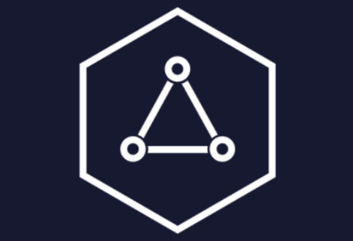

  
  <h1 align="center">Inter Blockchain Communication - Resource Vault</h1>
  
   
  

 
  
A comprehensive repository for resources on IBC

  
 Website: https://ibcprotocol.org/ 

-----------------------------------------------------------------------------------------

## Reads 📚

#### Understanding IBC: Beginner 🔥

- [ELI5: What is IBC?](https://medium.com/cosmos-blockchain/eli5-what-is-ibc-a212f518715f)
- [Deep Dive: How Will IBC Create Value for the Cosmos Hub?](https://blog.cosmos.network/deep-dive-how-will-ibc-create-value-for-the-cosmos-hub-eedefb83c7a0)

#### Understanding IBC: Intermediate 🔥🔥

- [Cosmos Developer Portal: IBC Explained](https://interchainacademy.cosmos.network/academy/ibc/what-is-ibc.html)
- [Everything you need to know about the Tendermint light client](https://medium.com/tendermint/everything-you-need-to-know-about-the-tendermint-light-client-f80d03856f98)
- [IBC: A Core Primitive for Interchain Native Products](https://medium.com/@interchain-io/ibc-a-core-primitive-for-interchain-native-products-38d73519cd66)
- [A comprehensive study on IBC relayers](https://medium.com/@interchain-io/relaying-the-message-a-deep-dive-into-ibc-relayer-operations-6ff763a2a22f)

#### Understanding IBC: Advanced 🔥🔥🔥

- [IBC whitepaper by Christopher Goes](https://ibcprotocol.org/documentation) 

#### IBC-level applications and features
- [A primer on Interchain Accounts](https://medium.com/@interchain-io/welcome-to-the-ibc-gang-lets-talk-f469883e0ffe)
- [Why Interchain Accounts Change Everything for Cosmos Interoperability](https://medium.com/chainapsis/why-interchain-accounts-change-everything-for-cosmos-interoperability-59c19032bf11)
- [How Interchain Accounts improve the UX of apps in the Cosmos ecosystem](https://www.coinbase.com/cloud/discover/insights-analysis/interchain-accounts-cosmos)
- [Interchain Security - Cross Chain Validation](https://github.com/cosmos/gaia/blob/724e2bd792ed1c1e4f8795db0f9c2f2dd8e18a9f/docs/interchain-security.md#ibc--cross-chain-validation)
- [A primer on the IBC fee middleware](https://medium.com/@interchain-io/ibc-relaying-as-a-service-the-in-protocol-incentivization-story-9922c7b953f0)

#### IBC - Interconnecting chains beyond the Cosmos Ecosystem ⚛️

- [Why the Inter-Blockchain Communication protocol (IBC) should expand cross-ecosystem](https://interchain-io.medium.com/why-the-inter-blockchain-communication-protocol-ibc-should-expand-cross-ecosystem-fddfbce1796)
- [Bringing IBC to NEAR](https://medium.com/composable-finance/bringing-ibc-to-near-our-near-polkadot-bridge-a8954d7ed886)
- [IBC: Expanding Polkadot’s Interoperability](https://www.coinbase.com/cloud/discover/insights-analysis/ibc-polkadot-interoperability)

#### Further reads 📑

- [IBC Beyond Light Clients: Solo Machine](https://medium.com/@interchain-io/ibc-beyond-light-clients-solo-machine-fb55ba0b0234)
- [IBC and XCMP: A Comparison of Interoperability Protocols](https://medium.com/@interchain-io/ibc-and-xcmp-a-comparison-of-interoperability-protocols-3d1700e30015)
- [A Comparison of Heterogeneous Blockchain Networks](https://medium.com/@arikan/a-comparison-of-heterogeneous-blockchain-networks-4bf7ff2fe279)
- [Flavors of Standalone Multichain Architecture](https://jumpcrypto.com/flavors-of-standalone-multichain-architecture-2/)

---------------------------------------------------------------------------------------------------------

## Podcasts / Videos  📺

- [IBC Explained to Cosmonauts: Episode 1](https://www.youtube.com/watch?v=dYuTYykRhH4&t=2s)
- [IBC Explained to Cosmonauts: Episode 2](https://www.youtube.com/watch?v=LVm-vyy75Hc)
- [Blockchain Interoperability using IBC](https://www.youtube.com/watch?v=LVm-vyy75Hc)
- [How the Inter-Blockchain Communication Standard Is Shaping an Interoperable Future](https://www.youtube.com/watch?v=9CGalMjmCzw)
- [IBC: Interoperability for Cosmos and Beyond](https://www.youtube.com/watch?v=SE9KH2Awoj4)
- [IBC Design](https://www.youtube.com/watch?v=SKyEC3BYDUg)
- [Cross-Chain Messaging With Interchain Accounts](https://www.youtube.com/watch?v=hi7mCCdfm90)
----------------------------------------------------------------------------------------------------------

## Developer resources 💻
#### Tutorials 🏫

- [Developer Portal - IBC](https://tutorials.cosmos.network/academy/4-ibc/)
- [Interchain GmbH Workshop: Building a Cross-Chain Application on top of IBC](https://www.youtube.com/watch?v=2nIRfTiaAUw)
- [How to use the Hermes Relayer](https://www.youtube.com/watch?v=cG1lpAwK1sc&t=1018s)
- [How to use IBC with CosmWasm](https://www.youtube.com/watch?v=cG1lpAwK1sc&t=1018s)

#### CosmWasm 💥
- [Official CosmWasm docs](https://docs.cosmwasm.com/docs/1.0/)
- [Terra Academy - CosmWasm](https://academy.terra.money/courses/cosmwasm-smart-contracts-i)
- [CosmWasm: Zero to Hero](https://github.com/Callum-A/cosmwasm-zero-to-hero)

#### Documentation / Github repo 📘

- [ibc-go roadmap](https://github.com/cosmos/ibc-go/blob/main/docs/roadmap/roadmap.md)
- [Canonical repo for IBC](https://github.com/cosmos/ibc)
- [Canonical repo for ibc-go](https://github.com/cosmos/ibc-go)
- [How to integrate IBC with your application](https://ibc.cosmos.network/main/ibc/integration.html)
----------------------------------------------------------------------------------------------------------

## Block explorers / Dashboard ⛓️
- [Minstcan](https://hub.mintscan.io/)
- [IOBscan](https://ibc.iobscan.io/home)
- [Mapofzones](https://mapofzones.com/?testnet=false&period=24)

----------------------------------------------------------------------------------------------------------

## Community 🧑‍🤝‍🧑
- [IBC techincal/security announcements](https://t.me/ibc_is_expansive)
- [Discord - IBC Gang](https://discord.com/invite/MkvKh6jpsA)
- [Cosmos community discord](https://discord.com/invite/W8trcGV)
- [Twitter](https://twitter.com/cosmosibc)
